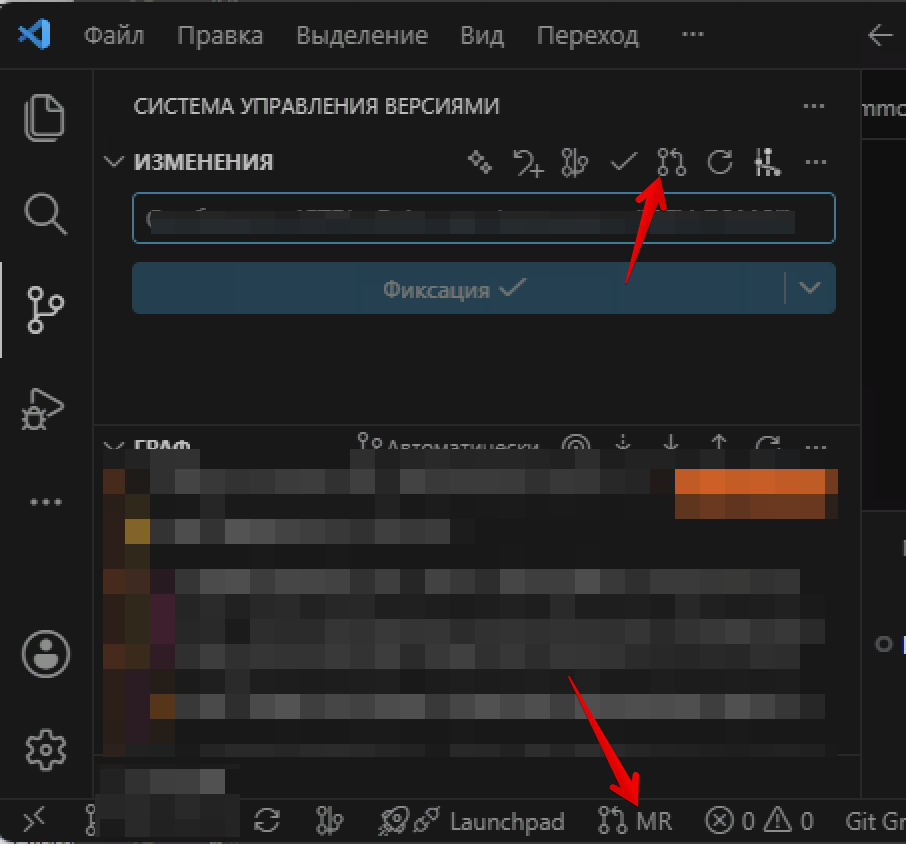
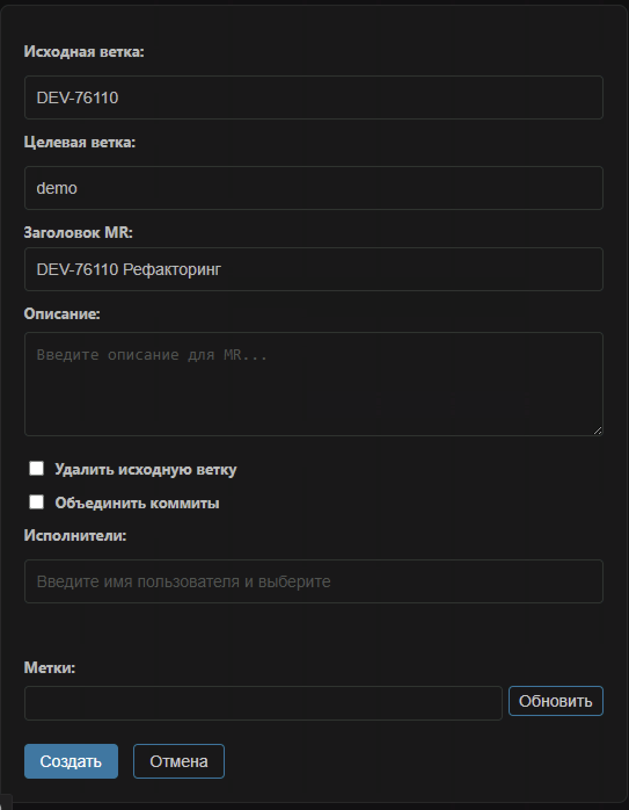

# VS Code - Gitlab MR UI

forked from https://github.com/JustLookAtNow/vscode-gitlab-mr

Add UI interface for creating merge requests.

Quickly search and select target branches, assignees, and automatically read tag lists in the UI interface.

Only support old version of Gitlab (about 10.x to 14.x).

After installing or updating the extension, reload the VS Code window if the `MR` status bar button is not visible.

## Features

* Supports both Gitlab.com and Gitlab CE/EE servers.
* Configurable default remote (e.g. `origin`) and branch (e.g. `master`).

### Create MR(UI)

Create an MR from VS Code by providing a branch name and commit message.
The `MR` status bar button checks the current branch against `gitlab-mr.targetBranch`. If an open MR already exists, the button changes to show the MR number and offers to open it.

**Workflow**

1. Click the 'Create MR' icon in the Source Control (SCM) view's title bar.
   
2. Enjoy the UI！
   

## Extension Settings

* `gitlab-mr.accessToken`: Access token to use to connect to the Gitlab.com API. Create one by going to Profile Settings -> Access Tokens.
* `gitlab-mr.accessTokens`: Access token to use to connect to Gitlab CE/EE APIs. Create one by going to Profile Settings -> Access Tokens.
* `gitlab-mr.apiVersion`: Gitlab API version. Note, `v4` is the only supported API version, but this setting can be used as an escape hatch in case your Gitlab instance is still on `v3`.
* `gitlab-mr.targetBranch`: Default target branch for MRs (defaults to `master`).
* `gitlab-mr.targetRemote`: Default target remote for MRs (defaults to `origin`).
* `gitlab-mr.useDefaultBranch`: When creating MRs, use `default_branch` set in repository as target branch.;
* `gitlab-mr.autoOpenMr`: Open newly created MRs in your browser.
* `gitlab-mr.openToEdit`: Open and edit newly created MRs in your browser.
* `gitlab-mr.removeSourceBranch`: When creating MRs, enable the option to remove the source branch after merging.
* `gitlab-mr.showStatusBarButton`: Show the `MR` button in the VS Code status bar.

### Access Tokens Example

```json
"gitlab-mr.accessTokens": {
    "https://gitlab.domain.com": "ACCESS_TOKEN_FOR_GITLAB.DOMAIN.COM"
}
```

## more usage

Install from marketplace https://marketplace.visualstudio.com/items?itemName=JustLookAtNow.gitlab-mr-ui
